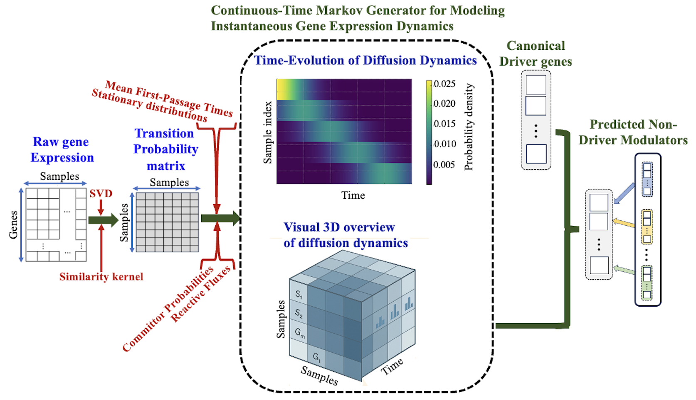

# DiMEXP
DiMEXP: Diffusion-Based Markov Modeling for Local-to-Global Gene Expression Dynamics and Identification of Non-Driver Gene Modulators. 
A computational framework for regulatory network inference in cancer, integrating diffusion-based propagation, continuous-time Markov generators, and causal inference.

$~~$

## Abstract

